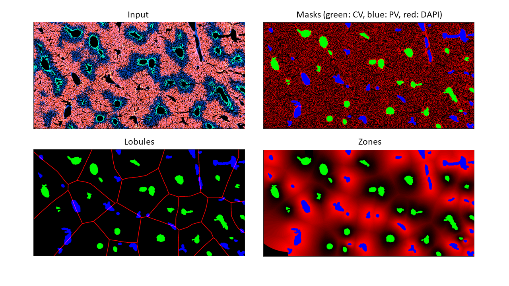

# Tissue Positioning System (TPS) - a quantitative, unsupervised algorithm for zonated expression pattern detection in Immunofluorescence images.

## Introduction
Tissue Positioning System algorithms is developed for learning zonated protein expression in hepatocytes. The pipeline is designed based on the following rationale and motivations:
* Protein expression in tissue is often in zonated patterns between/around certain feature.
* Manual identification of such patterns is not stably reproducible.
* Quantification of these zonated expression pattern very time consuming.

For current hepatocyte application, TPS require an input IF image to have DAPI channel for nuclei and GS channel for central veins. Firstly, the deep learning model will utilize the IF image to segment CV and PV region. Then the analysis pipeline will quantify the zonal expression pattern.



We welcome suggestions for other potential use cases.


## Installation
The deep learning model of TPS is build with [pytorch](https://pytorch.org/). Other dependencies include: [numpy](http://www.numpy.org/), [scipy](https://www.scipy.org/), [pandas](https://pandas.pydata.org/), [matplotlib](https://matplotlib.org/). [seaborn](https://github.com/mwaskom/seaborn), [scikit-image](https://scikit-image.org/) and [scikit-learn](https://scikit-learn.org/).

### 1. Build environment with conda
```
git clone https://github.com/yunguan-wang/Tissue_positioning_system.git
cd Tissue_positioning_system
conda env create -n myenv -f environment.yml
conda activate myenv
```
### 2. Test installation
```
python scripts/tps_worker.py dl_model/data/2w_Control_Cyp1a2-0301-f345-L1.tif
```
Outputs for the test example will be placed in `dl_model/data/2w_Control_Cyp1a2-0301-f345-L1`.

### 3. Using TPS with the deep-learning model 
#### 1. Hepatocyte zone analysis with the pretrained model
We provide a pretrained deep learning model ```./pretrained/tps_model.pt``` to segment cv and pv for given slides. 

#### a) Quick start 
```
python scripts/tps_worker.py --input [path/to/image]
```

#### b) Segmenting CV and PV in a folder of images on gpu and export torch jit model
```
python -u dl_model/inference.py --input ./data --rescale_factor 1.0 --device cuda --export
```
Run ```python inference.py -h``` for more options.


#### 2. Train a model based on customized dataset.
Specify data path, image scale and hyperparameters in ```data.yaml```. 
```
python -u dl_model/train.py --data data.yaml --exp_dir exp -num_epochs 100
```
Run ```python train.py -h``` for more options.

### 4. TPS analysis with out the deep-learning model
tps can be also be used with out the deep-learning model with the `tps_mophological_script.py` script.

```
positional arguments:
  input_img             Absolute Input TIF image to be zonated, with signal of
                        interest at channel 0, GS at channel 1 and DAPI at
                        channel 2

optional arguments:
  -o, --output          output folder of results, if not supplied, it will be
                        that same as the input file name. (default: )
  -v, --vessel_size_factor
                        Vessel size threshold as x/10000 fold of image size
                        (default: 2)
  -d, --maximal_neighbor_distance
                        maximal pixel distance between two neighboring masks
                        to be considered as two separate masks. (default: 20)
  -c, --dapi_cutoff
                        Dapi cutoff value for hard thresholding. (default: 20)
  -gl, --gs_lower_limit
                        The lower percentatge limit of GS signal intensity
                        within a mask, which is used in classify CV from PV
                        (default: 0.25)
  -gh, --gs_higher_limit
                        The higher percentatge limit of GS signal intensity
                        within a mask, which is used in classify CV from PV
                        (default: 0.75)
  -gs, --gs_step
                        The interval of percentage in the GS intensity
                        features. (default: 0.1)
```

<!---
## Gallery
Example results


-->

## Contact
If you have any questions or suggestions, please contact Yunguan Wang (yunguan.wang@utsouthwestern.edu) or Guanghua Xiao (guanghua.xiao@utsouthwestern.edu).

## More tools
Researchers searching for more bioinformatics tools can visit our lab website: https://qbrc.swmed.edu/labs/wanglab/index.php.
